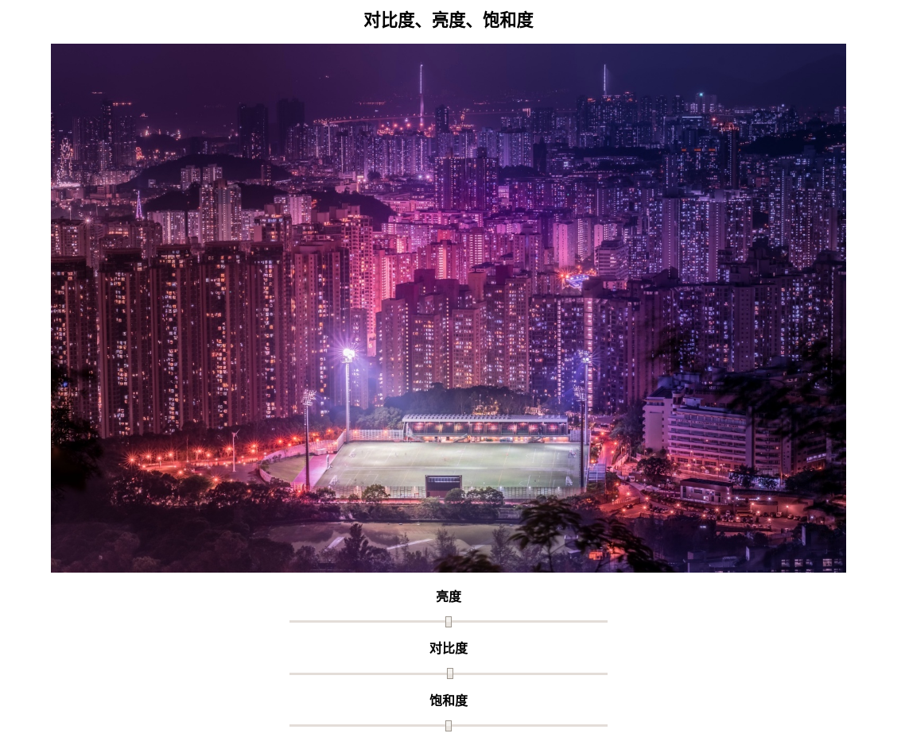
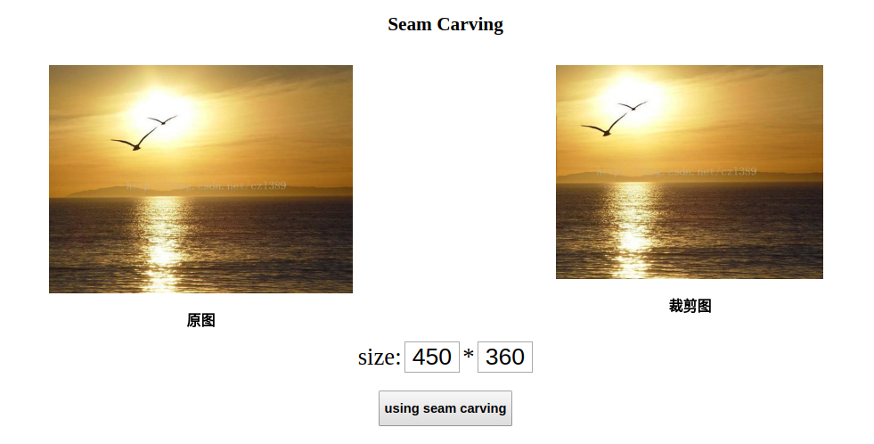
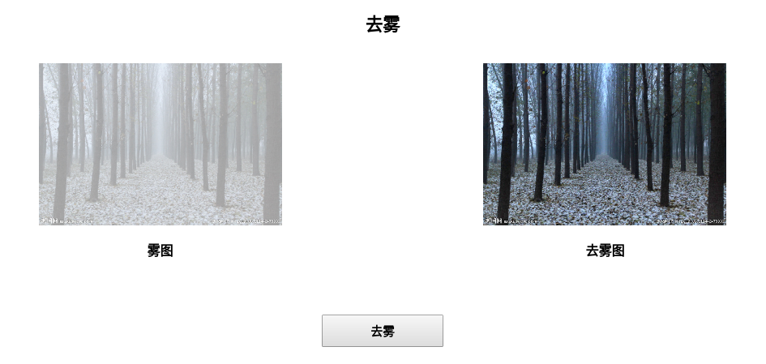

# **Image Processing**

>Author：zhiyu-Lin

>Date：2018-7-25

>E-mail: jhyxlzh@126.com

>Description: 数字媒体课程大作业，用django实现交互界面

###环境

python>=3.5

django==2.0.4

opencv-python==3.4.0.12

numpy==1.13.1

PIL==4.2.1

```shell
pip install -r requirements.txt
```

### 实现功能

改变图像对比度、饱和度、亮度-opencv库辅助完成

图像接缝裁剪-seam carving算法实现

图片去雾-暗通道去雾算法

### 运行

```python
#命令行输入
python manage.py runserver 0.0.0.0:8000
#在浏览器输入
localhost:8000/hello
```

### 结果

> 通过滑动条来调节图片对比度、亮度和饱和度，三种效果可重复叠加。



> 在size输入框中输入裁剪完的图片大小，点击按钮开始执行算法。原图（左），裁剪完图像（右）



> 左图为带雾图像，右图为去雾算法处理后的图像




